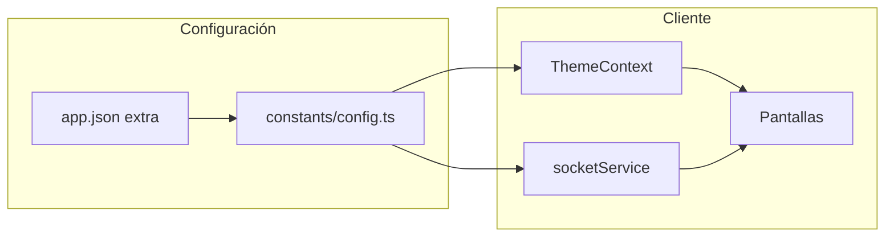

# Trivia Client (mobile)

Cliente móvil en **React Native** y **Expo** para un juego de trivia en tiempo real. La aplicación se conecta a un backend mediante **Socket.IO**, aplica **tema dinámico** cargado por HTTP y ofrece flujo de pantallas con **React Navigation** (login → lobby → partida).

---

## Tabla de contenidos

- [Trivia Client (mobile)](#trivia-client-mobile)
  - [Tabla de contenidos](#tabla-de-contenidos)
  - [Stack tecnológico](#stack-tecnológico)
  - [Requisitos](#requisitos)
  - [Instalación y arranque](#instalación-y-arranque)
  - [Scripts](#scripts)
  - [Configuración](#configuración)
  - [Arquitectura del código](#arquitectura-del-código)
  - [Flujo de datos](#flujo-de-datos)
  - [Builds y EAS](#builds-y-eas)
  - [Solución de problemas](#solución-de-problemas)
  - [Licencia](#licencia)

---

## Stack tecnológico

| Área | Tecnología |
|------|------------|
| Runtime | Expo SDK ~54, React 19, React Native 0.81 |
| Navegación | `@react-navigation/native`, `@react-navigation/stack` |
| Tiempo real | `socket.io-client` |
| Audio | `expo-av` |
| Configuración en cliente | `expo-constants` (lectura de `app.json` → `expo.extra`) |
| Lenguaje | TypeScript |

La **New Architecture** de React Native está habilitada (`newArchEnabled` en `app.json`).

---

## Requisitos

- **Node.js** LTS (recomendado: la versión indicada por el equipo o compatible con Expo SDK 54)
- **npm** o **yarn**
- Para dispositivo físico: app **Expo Go** o build de desarrollo nativo
- Cuenta de desarrollador Apple / entorno Android según la plataforma de destino (solo si generás builds de tienda)

---

## Instalación y arranque

```bash
git clone <url-del-repositorio>
cd trivia-client-mobile
npm install
npm start
```

Desde la interfaz de Expo podés abrir:

- **Android**: emulador o dispositivo (`a` en la CLI o `npm run android`)
- **iOS**: simulador o dispositivo (`i` en la CLI o `npm run ios`)
- **Web**: `npm run web` (soporte opcional; el foco del producto es móvil)

---

## Scripts

| Comando | Descripción |
|---------|-------------|
| `npm start` | Inicia el servidor de desarrollo de Expo (`expo start`) |
| `npm run android` | Arranca en Android |
| `npm run ios` | Arranca en iOS |
| `npm run web` | Arranca en navegador |
| `npm run tunnel` | Expo con túnel (útil si el dispositivo no está en la misma red) |

Verificación de tipos (recomendado en CI o antes de PR):

```bash
npx tsc --noEmit
```

---

## Configuración

Este proyecto **no utiliza archivos `.env`**. La configuración de red y timeouts es **explícita y versionada**:

1. Valores principales en [`app.json`](app.json), bajo `expo.extra`:
   - `socketUrl` — endpoint Socket.IO (namespace `/rooms` según el backend)
   - `themeApiUrl` — URL del JSON de tema (`/api/config`)
   - `apiTimeout` — timeout de conexión del cliente socket (ms)
   - `maxReconnectionAttempts` — reintentos de reconexión

2. En tiempo de ejecución, [`constants/config.ts`](constants/config.ts) lee `Constants.expoConfig.extra` mediante `expo-constants` y aplica **valores por defecto** si falta alguna clave (útil en entornos de prueba o herramientas).

Para apuntar a otro entorno (desarrollo local, staging, producción), **editá `app.json`** y commiteá el cambio, o usá una rama/build específica. No hace falta `app.config.js` salvo que el equipo decida lógica adicional sin variables de entorno.

---

## Arquitectura del código

Estructura orientada a responsabilidades claras:

```
├── App.tsx                 # Navegación raíz y providers
├── screens/                # Pantallas por flujo (Login, Lobby, Game)
├── components/             # UI reutilizable
├── contexts/               # Theme y Audio (React Context)
├── hooks/                  # Hooks (p. ej. useTheme)
├── services/               # Socket, audio (lógica de infraestructura)
├── constants/              # Configuración derivada de Expo (`config.ts`)
├── types/                  # Tipos TypeScript compartidos (dominio, UI, navegación)
└── assets/                 # Imágenes, sonidos, etc.
```

- **Tipos**: modelos de juego (`types/game.ts`), navegación (`types/navigation.ts`), tema, audio y props de componentes en `types/`.
- **Servicios**: `socketService` concentra la conexión y eventos; `audioService` encapsula `expo-av`.

---

## Flujo de datos



- **Tema**: al iniciar, `ThemeProvider` solicita la configuración visual al `themeApiUrl` y hace fallback a valores por defecto si falla la red o la respuesta.
- **Partida**: el cliente se conecta al `socketUrl` y reacciona a eventos (`roomState`, rondas, ranking, etc.) según el contrato del servidor.

---

## Builds y EAS

El proyecto incluye configuración de **EAS** (`eas.json`) y `projectId` en `expo.extra.eas`. Los builds de producción se gestionan con [EAS Build](https://docs.expo.dev/build/introduction/); las variables definidas en perfiles de EAS **no sustituyen automáticamente** la configuración del bundle JS: lo que consume la app es `app.json` + `constants/config.ts`, salvo que en el futuro el equipo inyecte valores en `extra` mediante otro mecanismo de build.

---

## Solución de problemas

| Síntoma | Qué revisar |
|---------|-------------|
| No conecta al socket | `socketUrl` en `app.json`, firewall/red, que el backend acepte WebSocket y CORS/origen según corresponda |
| Tema por defecto siempre | Fallo de red o API; revisá `themeApiUrl` y la forma del JSON esperado por el cliente |
| Metro / bundler | `npx expo start -c` para limpiar caché |
| Tipos inconsistentes | `npx tsc --noEmit` |

---

## Licencia

Este repositorio es **público** y el código se distribuye bajo la licencia **MIT**. El texto legal completo está en [`LICENSE`](LICENSE).

En la práctica, la MIT permite que otros usen, modifiquen y distribuyan el código **incluyendo el aviso de copyright y la licencia**, y sin garantía expresa. 
